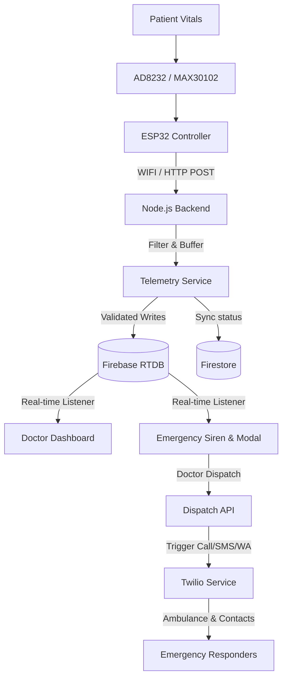

# Project Architecture

The architecture of HeartSync is designed to process high-frequency physiological telemetry and orchestrate clinical alerts with maximum reliability.

## Core Components

### 1. IoT Sensors & ESP32
* **AD8232 ECG Sensor:** Captures electrical cardiac activity (analog signal).
* **MAX30102 Pulse Oximeter:** Measures pulse rates and blood oxygen levels (SpO₂).
* **ESP32 Microcontroller:** Samples the analog outputs, performs baseline filtering, and packages telemetry into JSON payloads.

### 2. Telemetry Ingestion Service (Node.js)
* Validates every telemetry packet to reject `0` readings, startup spikes, and sensor-off events.
* Maintains a rolling buffer of 10 consecutive valid readings to detect sustained hazards.
* Streams telemetry data to Firebase Realtime Database across legacy and new unified paths.

### 3. Firebase Synchronization Grid
* **Realtime Database (RTDB):** Powers real-time ECG waveform plotting, vitals tracking, and immediate status synchronization.
* **Cloud Firestore:** Manages user registrations, doctor profiles, and emergency logs.

### 4. Emergency Orchestration Pipeline
* Displays visual notifications and sounds clinical sirens immediately upon receiving alerts.
* Allows manual emergency overrides from the patient interface.
* Twilio Sequential Dispatch: Executes emergency calls, SMS messages, and WhatsApp alerts to emergency contacts only when authorized by doctors or manual patient confirmation.
